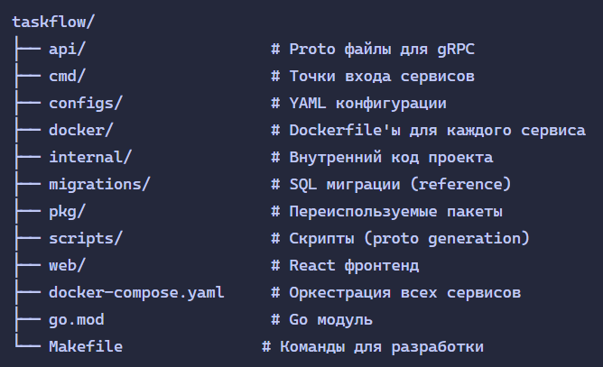
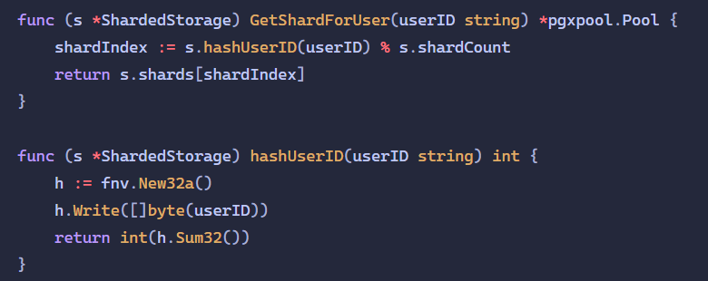
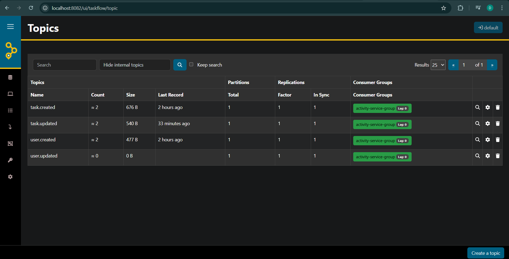
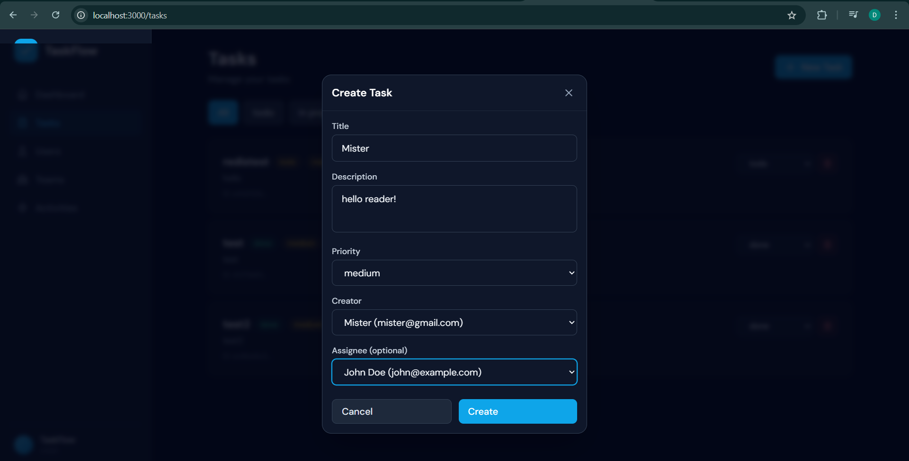
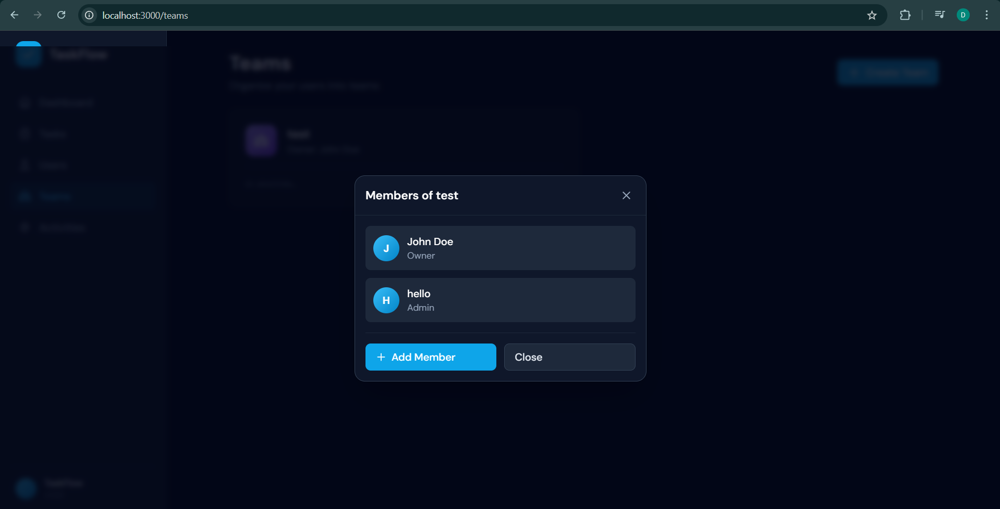

# TaskFlow

[](https://golang.org)
[](LICENSE)

TaskFlow - это платформа управления задачами на основе микросервисной архитектуры, построенная на Go.

🔗 **Репозиторий**: [github.com/Sol1tud9/taskflow](https://github.com/Sol1tud9/taskflow)

## Что это?

TaskFlow состоит из нескольких микросервисов, которые работают вместе через события Kafka:

- **user-service** - управление пользователями и командами
- **task-service** - управление задачами
- **activity-service** - логирование всех действий (шардирование)
- **api-gateway** - единая точка входа для всех запросов
- **web** - React фронтенд

## Технологии

- **Go 1.24** - основной язык
- **PostgreSQL** - база данных (database-per-service)
- **Kafka** - обмен событиями между сервисами
- **Redis** - кэширование
- **React** - фронтенд
- **Docker Compose** - для локальной разработки

## Быстрый старт

### Запуск через Docker

```bash
docker compose up --build
```

После запуска будут доступны:

- **Фронтенд**: http://localhost:3000
- **API Gateway**: http://localhost:8080
- **Swagger UI**: http://localhost:8080/swagger
- **Kafka UI**: http://localhost:8081
- **AKHQ**: http://localhost:8082


### Локальный запуск

1. Запустить инфраструктуру:
```bash
docker compose up redis postgres-user postgres-task postgres-activity-shard-0 postgres-activity-shard-1 kafka -d
```

2. Запустить сервисы:
```bash
# User Service
go run ./cmd/user-service/main.go

# Task Service  
go run ./cmd/task-service/main.go

# Activity Service
go run ./cmd/activity-service/main.go

# API Gateway
go run ./cmd/gateway/main.go
```

## Структура проекта



## Основные возможности

### API Endpoints

**Пользователи:**
```bash
POST   /api/v1/users              # Создать пользователя
GET    /api/v1/users/{id}         # Получить пользователя
PATCH  /api/v1/users/{id}         # Обновить пользователя
```

**Команды:**
```bash
POST   /api/v1/teams              # Создать команду
GET    /api/v1/teams/{id}         # Получить команду
POST   /api/v1/teams/{id}/members # Добавить участника
```

**Задачи:**
```bash
POST   /api/v1/tasks              # Создать задачу
GET    /api/v1/tasks              # Список задач
PATCH  /api/v1/tasks/{id}         # Обновить задачу
DELETE /api/v1/tasks/{id}         # Удалить задачу
```

**Активности:**
```bash
GET    /api/v1/activities         # Список активностей
GET    /api/v1/users/{id}/activities # Активности пользователя
```

### Шардирование

Activity Service использует шардирование по `user_id` для масштабирования:

```
shard_index = hash(user_id) % shard_count
```



### События Kafka

Сервисы обмениваются событиями через Kafka:



## Тестирование

```bash
# Запуск всех тестов
go test ./... -v

# С покрытием
go test ./... -cover -coverprofile=coverage.out
go tool cover -html=coverage.out
```

**Покрытие тестами:**
- 25 unit-тестов (UserUseCase, TeamUseCase, TaskUseCase, ActivityUseCase, RedisCache)
- Integration тесты (20%)
- E2E тесты (10%)

## Разработка

### Генерация Proto файлов

```bash
make proto
```

### Генерация Swagger

```bash
make swagger
```

### Линтинг

```bash
make lint
```

### Сборка

```bash
make build
```

## Скриншоты

### Главная страница


### Создание задачи


### Управление командами


## Лицензия

MIT License
